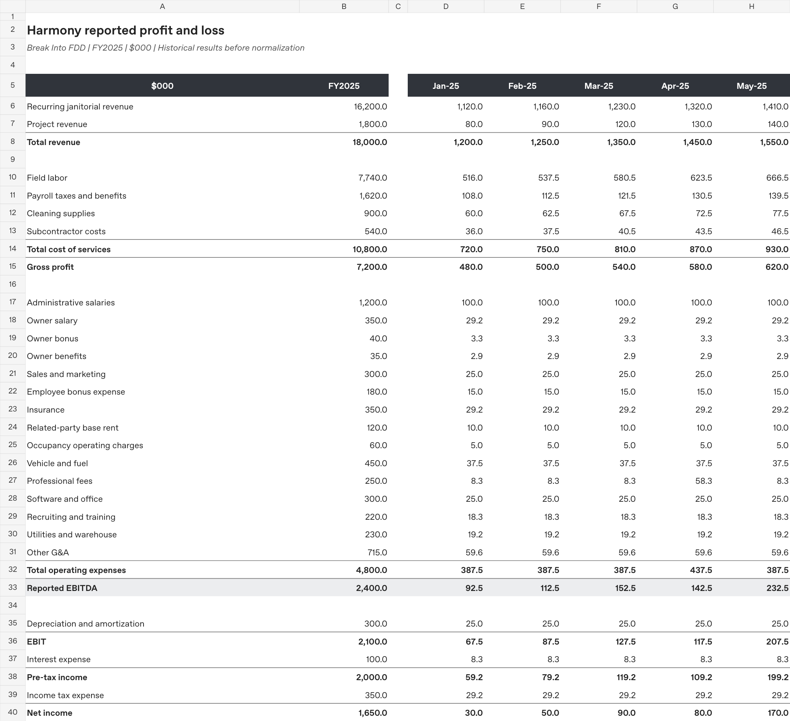
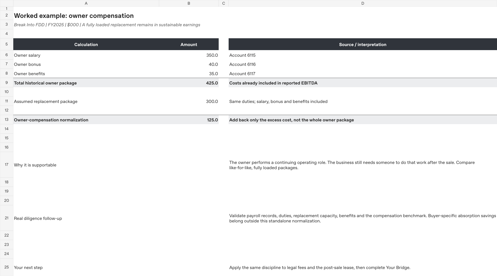
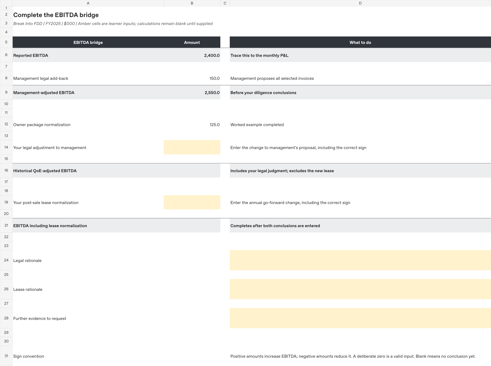

# Harmony Case 01: From Trial Balance to EBITDA

A guided, synthetic Financial Due Diligence case by **Break Into FDD**.

Start with an accounting-system-style trial balance, trace it into a monthly P&L, and assess whether management's proposed adjustments reflect sustainable earnings. The company is a fictional commercial cleaning business with $18.0m of revenue and $2.4m of reported EBITDA.

[Download the guided Excel workbook](Harmony_Case_01_Guided_Demo.xlsx)

## Quick tour

1. **Reported PL:** inspect the monthly P&L and trace a number back to its source
2. **Owner Example:** follow a fully worked normalization using salary, bonus, benefits and an assumed replacement package
3. **Your Bridge:** complete the legal-fee and post-sale lease conclusions, then explain the evidence behind them

## What the workbook demonstrates

- **Accounting preparation:** account mapping, sign conventions and conversion of YTD balances into monthly activity
- **Traceable analysis:** formulas connect raw source data, mapping, monthly amounts and the reported P&L
- **Reconciliation:** source checks test the trial balance and reported earnings
- **Diligence judgment:** distinguish management's proposal, supportable earnings normalization and a go-forward change in standalone costs
- **Clear communication:** document the conclusion, its limits and the additional support a real transaction would require

## One worked example

The owner performs a continuing operating role. The example compares a $425k historical package with an assumed $300k fully loaded replacement package. It retains the replacement cost and calculates the excess compensation adjustment.

The replacement amount is a fictional case assumption, not an independently verified market benchmark.

## Your assignment

Read **Case Facts**, including six selected legal invoices and the replacement-lease facts. Management proposes adding back all selected legal fees. The new lease becomes effective at closing, so distinguish historical earnings from the go-forward cost base.

In **Your Bridge**:

1. Enter the signed change to management's legal-fee proposal
2. Enter the signed annual lease normalization
3. Explain both conclusions and the further evidence you would request

Blank inputs remain blank. A deliberate zero is accepted. Historical QoE-adjusted EBITDA calculates once the legal conclusion is entered; the final subtotal calculates after both conclusions are entered.

**Deliverable:** the completed bridge and a concise rationale for each remaining adjustment. Keep the reported P&L intact.

## File guide

- `Harmony_Case_01_Guided_Demo.xlsx`: source data, accounting workflow, worked example and exercise
- `screenshots/`: previews rendered from the actual workbook

The workbook contains nine visible sheets: Start Here, Reported PL, Owner Example, Your Bridge, Case Facts, Mapping, Monthly TB, Raw TB and Checks.

Amounts are in $000. Raw P&L accounts are YTD balances; balance-sheet accounts are month-end balances. The workbook uses ordinary Excel formulas, with no macros, external workbook links or add-ins. Gridlines are hidden and fonts are Arial.

## Scope and data

Harmony, its financial information and every supporting record are invented for education. No real employer, client, vendor, customer or deal data is used.

This is a guided three-issue demo. The complete answer key and broader case materials are not included. The exercise does not cover NWC, net debt, purchase accounting or buyer-specific integration savings.

Prepared by **Break Into FDD**.
